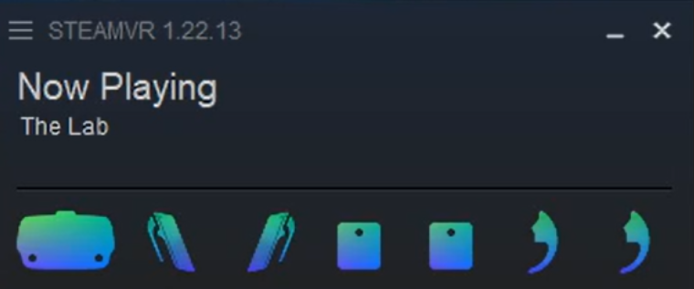

<!-- README file in MD for the etee OpenVR Driver repository-->
<a name="readme-top"></a>
<!--
*** Attribution and thanks: README template adapted from Othneil Drew's example, available at:
*** https://github.com/othneildrew/Best-README-Template
-->


<!-- PROJECT LOGO -->
<br />


<p align="center">
   Official Driver for the eteeControllers in SteamVR.
   <br />
   <a href="https://github.com/eteeXR/etee-OpenVR-Driver/wiki"><strong>Explore the wiki »</strong></a>
   <br />
   <a href="https://github.com/eteeXR/etee-OpenVR-Driver/issues">Report Bug</a>
   ·
   <a href="https://github.com/eteeXR/etee-OpenVR-Driver/issues">Request Feature</a>
</p>


<!-- SHIELDS FOR REPO -->
<br />
<p align="center">
    <a>
        </a>
    <a>
        </a>
    <a>
        </a>
</p>

<!-- SHIELDS FOR SOCIALS -->
<p align="center">
    <a href="https://eteexr.com/">
        </a>
    <a href="customer@eteexr.com">
        </a>
    <a href="https://twitter.com/etee_tg0">
        </a>
</p>


<!-- TABLE OF CONTENTS -->
<details>
  <summary>Table of Contents</summary>
  <ol>
    <li>
      <a href="#about-the-project">About The Project</a>
    </li>
    <li>
      <a href="#getting-started">Getting Started</a>
      <ul>
        <li><a href="#clone-repo">Step 1: Clone the Repository</a></li>
        <li><a href="#driver-setup">Step 2: Driver Setup</a></li>
        <li><a href="#add-driver">Step 3: How to Add the Driver</a></li>
      </ul>
    </li>
    <li>
      <a href="#usage">Usage</a>
      <ul>
        <li><a href="#steamvr">SteamVR</a></li>
        <li><a href="#hardware-setup">Hardware Setup</a></li>
      </ul>
    </li>
    <li><a href="#contributing">Contributing</a>
      <ul>
        <li><a href="#how-to-contribute">How to Contribute</a></li>
        <li><a href="#semantic-type-prefixes">Semantic Type Prefixes</a></li>
      </ul>
    </li>
    <li><a href="#authors">Authors</a></li>
    <li><a href="#license">License</a></li>
    <li><a href="#contact">Contact</a></li>
  </ol>
</details>


<!-- ABOUT THE PROJECT -->
## About the Project

This repository contains the [OpenVR][url-openvr-repo] driver source files and deployable builds for TG0 etee devices. This driver allows for the etee hardware devices to integrate into the SteamVR platform.

<!-- GETTING STARTED -->
## Getting Started

<a name="clone-repo"></a>

### Step 1: Clone the repository

1. Open a command prompt.
2. Change the current working directory to the location where you want the cloned directory.
3. Type git clone, and then paste the URL for the Github repository.
    ```sh
    git clone https://github.com/eteeXR/etee-OpenVR-Driver.git
    ```

---

<a name="driver-setup"></a>

### Step 2: Driver setup

Depending on your needs, you might decide to use (a) deployable drivers (i.e. ready-to-use) or (b) build and test your own driver changes.

#### 2.A. Deployable Drivers

> **Description**: Device drivers ready to be used in SteamVR.

Located in the [/deployable](/deployable/) folder, you can find different versions of available drivers which can be directly used with your SteamVR application.

To deploy the selected etee VR driver, follow the instructions in Step 3.

#### 2.B. Building Drivers

> **Description**: Build and test your own custom driver changes in SteamVR.

Otherwise, if you want to test your code changes, please check our [***Building*** documentation](BUILDING.md) in the wiki.

---

<a name="add-driver"></a>

### Step 3: How to add the driver

#### Method A: Move the folder

Copy the desired etee driver folder to the SteamVR drivers folder, usually located in: 
<br/>
`C:\Program Files (x86)\Steam\steamapps\common\SteamVR\drivers`

For **deployable drivers**, unzip the desired version and drag the `etee` folder inside it to the SteamVR drivers folder above.

For **custom driver builds**, make sure that the driver folder you build is in Release mode. See more at: [***Building*** documentation](BUILDING.md).

#### Method B: Add Driver Location To OpenVR Path

Add the path location of the desired driver folder to the `openvrpaths.vrpath` file, in the `external_drivers` array. Make sure to use proper JSON formatting with double dashes and correct comma placement. Use a validator to check the JSON format is correct, as SteamVR will overwrite the file when improper formatting or errors cause the driver to not activate.

A common location for the "openvrpaths.vrpath" file is:
<br/>
`C:\Users\<username>\AppData\Local\openvr`

For example, if you're using a **deployable driver**, first unzip the version of the driver you wish to deploy. Then, format your "openvrpaths.vrpath" file as described above. The file might look similar to this:

```json
{
	"config" : 
	[
		"c:\\program files (x86)\\steam\\config"
	],
	"external_drivers" : 
	[
		"C:\\Users\\MyUser\\Documents\\etee-OpenVR-Driver\\deployable\\etee-vr-driver_1.4.1-release\\etee"
	],
	"jsonid" : "vrpathreg",
	"log" : 
	[
		"c:\\program files (x86)\\steam\\logs"
	],
	"runtime" : 
	[
		"C:\\Program Files (x86)\\Steam\\steamapps\\common\\SteamVR"
	],
	"version" : 1
}
```

If you want to use your **custom driver build**, then your path may look like:

```json
	"external_drivers" : 
	[
		"C:\\Users\\MyUser\\Documents\\etee-OpenVR-Driver\\build\\Release\\etee"
	],
```

**Note:** The order of the *external_drivers* paths are important. 

If you have downloaded our *eteeConnect* app, then you will see its path in the *external_drivers* array, pointing at our official driver release. Do not delete the eteeConnect path, simply paste your desired new etee driver path before it. SteamVR will executes the external drivers in order, and when two of the same driver are available, it ignores the second one if the first one successfully activates.

<p align="right">(<a href="#readme-top">back to top</a>)</p>


<!-- HARDWARE SETUP -->
## Usage

### SteamVR

This driver allows the etee hardware devices to connect the [SteamVR][url-steamvr] platform. 

The etee OpenVR driver will automatically activate when an eteeDongle is detected in a PC or laptop COM port. If the driver is active, you will see the controller icons change to the etee ones.

<p align="center">
  
  <br/>
  <em>etee devices icons active in the SteamVR Status Window.</em>
</p>

### Hardware Setup

The device firmware versions required for this driver version is:
* eteeController(s) Firmware: `1.3.7.stable.0` or higher.

> **Note**: Firmware for etee devices can be updated through the official [eteeConnect][url-eteeconnect] app, under the ‘Settings ‣ Firmware’ Section.

For further information on how to prepare your physical devices, check our [Quickstart Guide][url-eteexr-svr-qsg].

<a href="https://eteexr.com/pages/eteecontroller-steamvr-guide">
  
</a>

<p align="right">(<a href="#readme-top">back to top</a>)</p>


<!-- CONTRIBUTING -->
## Contributing

### How to Contribute

Contributions are what make the open source community such an amazing place to learn, inspire, and create. 
Any contributions you make are **greatly appreciated**.

If you have a suggestion that would make this better, please fork the repo and create a pull request. 
You can also simply open an issue to describe your suggestion or report a bug.

1. Fork the Project
2. Create your Feature Branch (`git checkout -b feature/AmazingFeature`)
3. Commit your Changes (`git commit -m 'Add some AmazingFeature'`)
4. Push to the Branch (`git push origin feature/AmazingFeature`)
5. Open a Pull Request

### Semantic Type Prefixes

To help us and the community easily identify the nature of your *commit* or *issue*, use **semantic type prefixes** 
to precede your message / title.

Some common type prefixes include:

- `feat`: A new feature for the user, not a new feature for a build script.
- `fix`: Bug fix for the user, not a fix for a build scripts.
- `enhanc`: Enhancement or improvement to existing feature.
- `perf`: Code improved in terms of processing performance.
- `refactor`: Refactoring production code (e.g. renaming a variable).
- `chore`: Changes to the build process or auxiliary tools and libraries.
- `docs`: Changes to documentation.
- `style`: Formatting, missing semicolons, etc. No code change.
- `vendor`: Update version for dependencies and other packages.
- `test`: Adding missing tests or refactoring tests. No production code change.

**Format**: `<type>(<scope>): <subject>`, where < scope > is optional.

For example, your commit message header might look like this:
```text
feat(imu): Implemented Euler angles estimation from quaternion
```

For more references and guides on semantic code messages, see:

- [How are you writing a commit message?][url-semantic-type-prefixes-1] - by Darkø Tasevski
- [Git Commit Msg][url-semantic-type-prefixes-2] - Karma by Friedel Ziegelmayer

<p align="right">(<a href="#readme-top">back to top</a>)</p>

<!-- AUTHORS-->
## Authors

This repository was created by the [TG0][url-tg0-website] team, for the [etee][url-eteexr-website] brand.

Code and documentation authors include:
- Daniel Willmott
- Pilar Zhang Qiu
- Harvey Upton

<p align="right">(<a href="#readme-top">back to top</a>)</p>

<!-- LICENSE -->
## License

Distributed under the Apache 2.0 License. See `LICENSE.txt` for more information.

<p align="right">(<a href="#readme-top">back to top</a>)</p>


<!-- CONTACT -->
## Contact

For any queries or reports, please use the [**Issues tab**][url-issues-tab] in this repository.
When possible, use an identifier to help us describe your query, report or request. 
See more at: <a href="#semantic-type-prefixes">Semantic Type Prefixes</a>.

For further support or queries, you can contact us:
- Support e-mail: [customer@eteexr.com](customer@eteexr.com)
- Support Form: [https://eteexr.com/pages/support-form](https://eteexr.com/pages/support-form)

<p align="right">(<a href="#readme-top">back to top</a>)</p>


<!-- MARKDOWN LINKS & IMAGES -->
<!-- https://www.markdownguide.org/basic-syntax/#reference-style-links -->
[url-openvr-repo]: https://github.com/ValveSoftware/openvr
[url-steamvr]: https://store.steampowered.com/app/250820/SteamVR/
[url-tg0-website]: https://tg0.co.uk/
[url-eteexr-website]: https://eteexr.com/
[url-eteexr-svr-qsg]: https://eteexr.com/pages/eteecontroller-steamvr-guide
[url-eteeconnect]: https://store.steampowered.com/app/1590110/eteeConnect/
[url-issues-tab]: https://github.com/eteeXR/etee-OpenVR-Driver/issues
[url-semantic-type-prefixes-1]: https://dev.to/puritanic/how-are-you-writing-a-commit-message-1ih7
[url-semantic-type-prefixes-2]: http://karma-runner.github.io/1.0/dev/git-commit-msg.html
